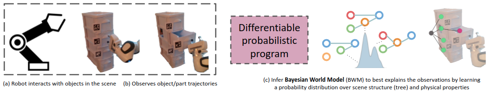
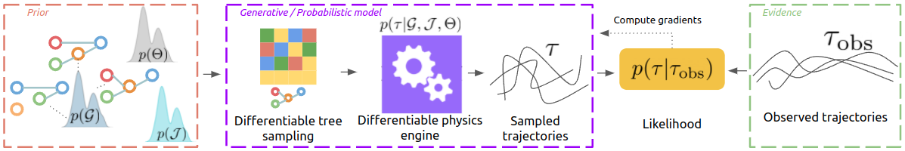
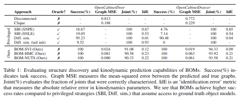
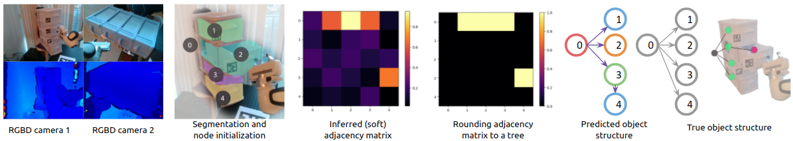

---
# Feel free to add content and custom Front Matter to this file.
# To modify the layout, see https://jekyllrb.com/docs/themes/#overriding-theme-defaults

permalink: /
title: Bayesian Object Models
layout: home
---

> A hallmark of human intelligence is the ability to build rich mental models of previously unseen objects from very few interactions. To achieve true, continuous autonomy, robots too must possess this ability. Importantly, to integrate with the probabilistic robotics software stack, such models must encapsulate the uncertainty (resulting from noisy dynamics and observation models) in a prescriptive manner. We present Bayesian Object Models (BOMs): generative (probabilistic) models that encode both the structural and kinodynamic attributes of an object. BOMs are implemented in the form of a differentiable probabilistic program that models latent scene structure, object dynamics, and observation models. This allows for efficient and automated Bayesian inference -- samples (object trajectories) drawn from the BOM are compared with a small set of real-world observations and used to compute a likelihood function. Our model comprises a differentiable tree structure sampler and a differentiable physics engine, enabling gradient computation through this likelihood function. This enables gradient-based Bayesian inference to efficiently update the distributional parameters of our model. BOMs outperform several recent approaches, including differentiable physics-based, gradient-free, and neural inference schemes.

## Overview of our approach

<figure>
	
	<figcaption>A probabilistic program (shown above) samples random variables encoding a scene structure (a graph $\mathcal{G}$), physical constraints $\mathcal{J}$, and object physical properties $\Theta$. These sampled variables are used to initialize a differentiable physics engine that simulates the dynamics of the environment and computes a likelihood function. A key idea here involves a differentiable sampling procedure for the graph-structured variables, which allows us to perform gradient-based (variational) inference of the posterior over the random variables of interest.</figcaption>
</figure>

## Results

	

